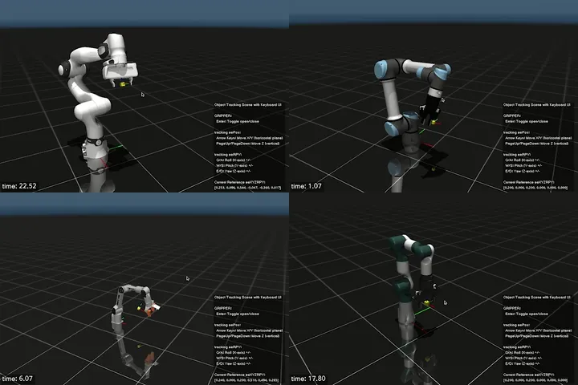
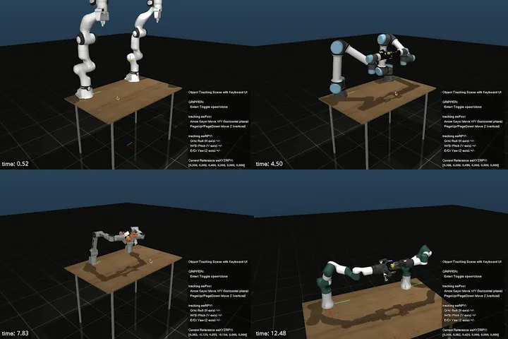
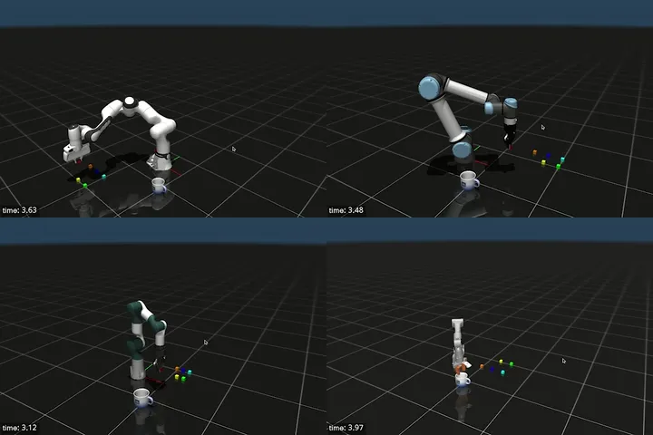
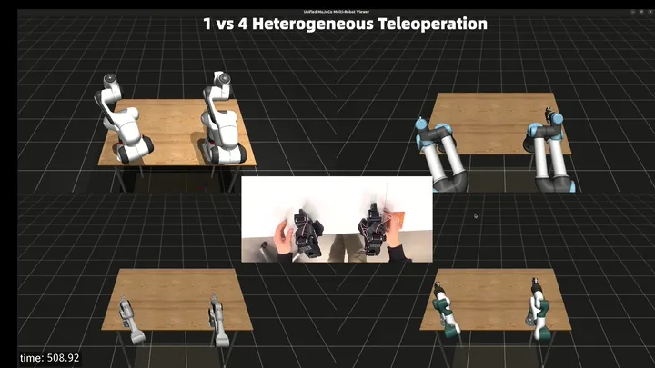

# RynnMotion

> A framework aiming to bridge fast robot prototyping, predefined motion promitives, heterogeneous teleoperation, data collection, and flexible deployment across diverse robot platforms.

<p align="center">
  
  
  
  
  
  
</p>

<p align="center">
  <a href="#-quick-start">Quick Start</a> •
  <a href="#-key-features">Features</a> •
  <a href="#-examples--tutorials">Examples</a> •
  <a href="docs/ARCHITECTURE.md">Architecture</a> •
  <a href="#-documentation">Docs</a> •
  <a href="#-community">Community</a>
</p>

---

## 🚀 Quick Start

### Option 1: Native Installation (Recommended - Production Ready)

```bash
# 1. Install dependencies (one-time, 30-60 min)
sudo ./scripts/setup_dependencies.sh  # Linux
# OR
./scripts/setup_dependencies.sh       # macOS (no sudo)

# 2. Build
mkdir build && cd build
cmake ..
make -j$(nproc)

# 3. Run your first simulation
./mujocoExe fr3 ui
./mujocoExe ur5e pickplace
```

**See detailed guide:** [Installation Documentation](docs/installation.md)

### Option 2: Docker (Experimental - Untested)

> ⚠️ **Note:** Docker setup has not been fully tested. For production use, please use native installation above.

```bash
# Clone repository
git clone https://github.com/alibaba-damo-academy/RynnMotion.git
cd RynnMotion

# Build and run Docker container
./scripts/docker-build.sh
./scripts/docker-run.sh

# Inside container: build
mkdir build && cd build
cmake .. && make -j$(nproc)
./mujocoExe fr3 1~5 #
```

**See detailed guide:** [Docker Setup](docs/DOCKER-SETUP.md) (experimental)

---

#### Prerequisites

- Ubuntu 22.04+ or macOS 13+
- Internet connection

#### Quick Setup

```bash
# 1. Clone repository
git clone https://github.com/alibaba-damo-academy/RynnMotion.git
cd RynnMotion

# 2. Install dependencies
sudo ./scripts/setup_dependencies.sh  # Linux
# OR
./scripts/setup_dependencies.sh       # macOS (no sudo)

# 3. Build RynnMotion
mkdir build && cd build
cmake ..
make -j$(nproc)

# 4. Install Python package (optional)
cd ../python
pip install -e .

# 5. Test it works!
./build/mujocoExe fr3 1
```

#### What Gets Installed

**Dependencies:** Eigen (≥3.3.0), Boost (≥1.65), Pinocchio (v3.7.0), MuJoCo (3.3.5), yaml-cpp, qpOASES, LCM, FCL, Ruckig (v0.15.3), OpenCV, nlohmann/json

**Installation locations:** `/usr/local/` (Linux/macOS)

#### Troubleshooting

See comprehensive [Installation Guide](docs/installation.md) for:

- Platform-specific instructions
- Manual dependency installation
- Common errors and solutions
- Verification steps

<summary><b>🐳 Docker Installation (Experimental)</b></summary>

> ⚠️ **Experimental Status:** Docker setup has not been fully tested. For production use, please use native installation.

#### Quick Setup

```bash
# 1. Build Docker image
./scripts/docker-build.sh

# 2. Run container
./scripts/docker-run.sh

# 3. Build inside container
mkdir build && cd build
cmake .. && make -j$(nproc)

# 4. Test
./mujocoExe fr3 ui # or scenenumber 1 ~ 5
```

## 🎬 Demos & Features

### 1. Single-Arm Robot Control

**OSC-based trajectory tracking** with real-time visualization:

<p align="center">
  
</p>

High-performance operational space control with MuJoCo simulation. Track complex trajectories with sub-millimeter precision.

```bash
# Run single-arm demo
cd build
./mujocoExe fr3 1  # FR3 robot figure-8 tracking
./mujocoExe ur5e 1  # UR5e robot tracking
```

---

### 2. Dual-Arm Coordination

**Synchronized dual-arm control** with independent OSC controllers:

<p align="center">
  
</p>

Coordinate two robot arms seamlessly. Each arm runs independent OSC with nullspace optimization for redundancy resolution.

```bash
# Run dual-arm demo
./mujocoExe dual_fr3 1      # Dual FR3 tracking
./mujocoExe dual_ur5e 1     # Dual UR5e tracking
./mujocoExe piper 1         # Piper dual-arm robot
```

---

### 3. Pick-and-Place Automation

**State machine-based object manipulation** with dual-arm robots:

<p align="center">
  
</p>

Fully automated pick-and-place pipeline with visual feedback. FSM handles approach, grasp, transfer, and release phases.

```bash
# Run pick-and-place demo
./mujocoExe dual_fr3 pickplace
```

---

### 4. Multi-Robot Teleoperation

**1 Master → 4 Slave Robots** in real-time teleoperation:

<p align="center">
  
</p>

One SO101 master arm controlling 4 different slave robots (FR3, UR5e, Piper, RM75) simultaneously.

```bash
cd robots/RynnLeRobot
./setup_lerobot.sh && source .venv/bin/activate
multi-teleop -d
```

---
