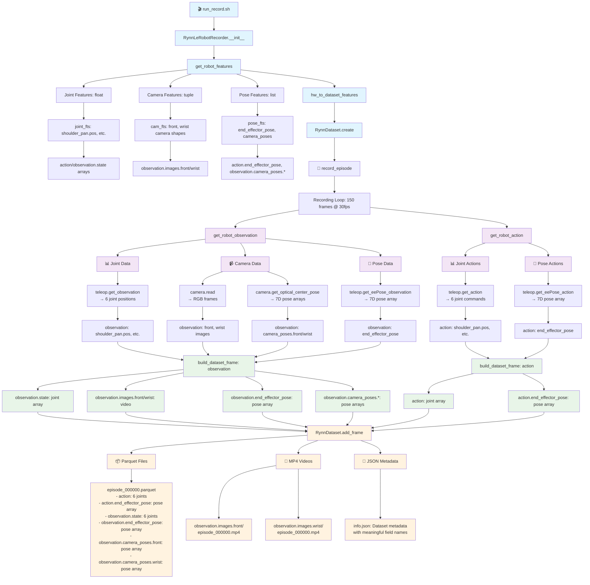
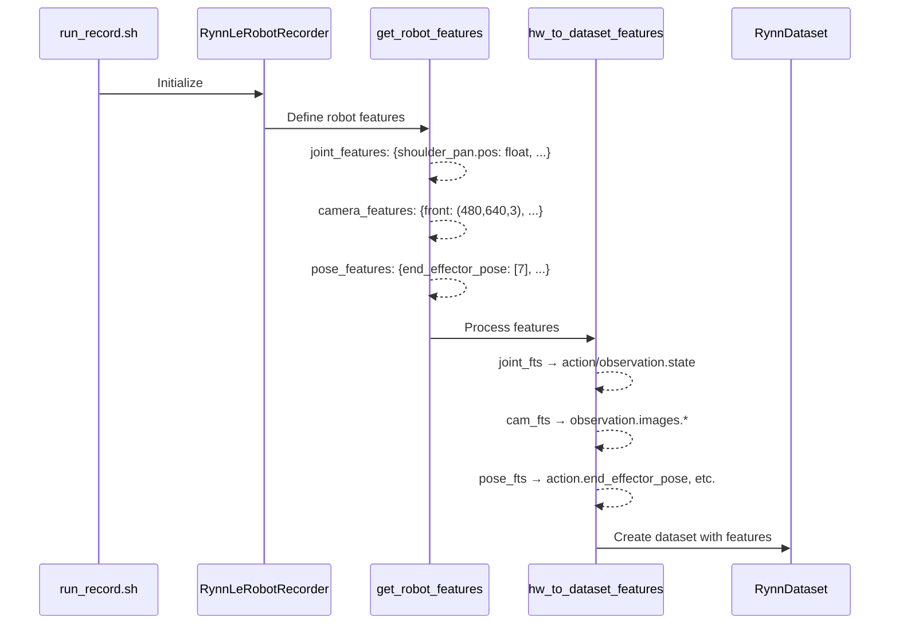
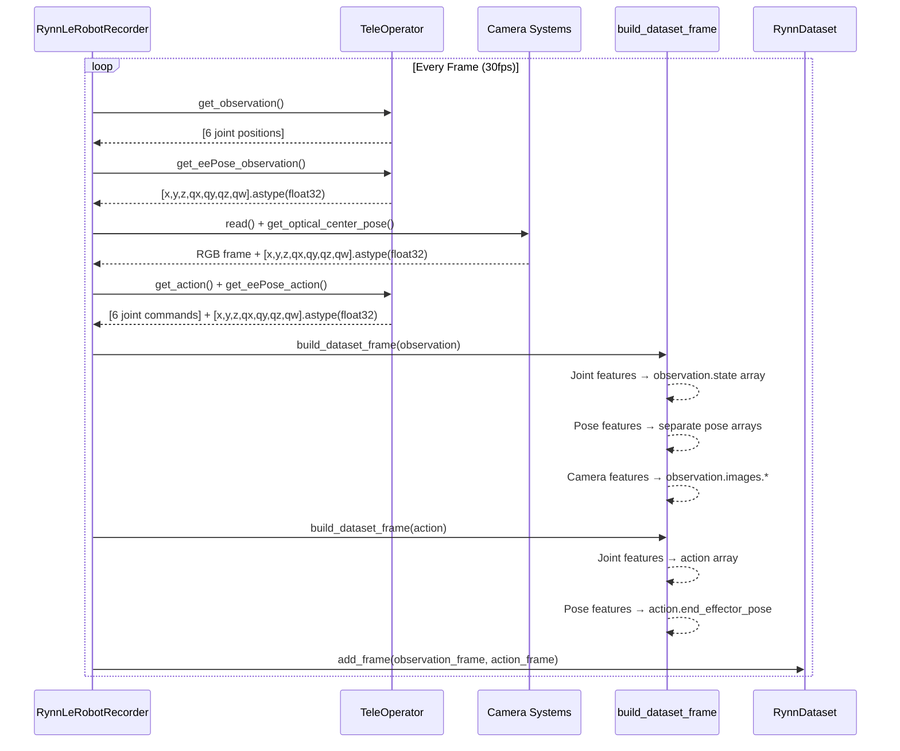
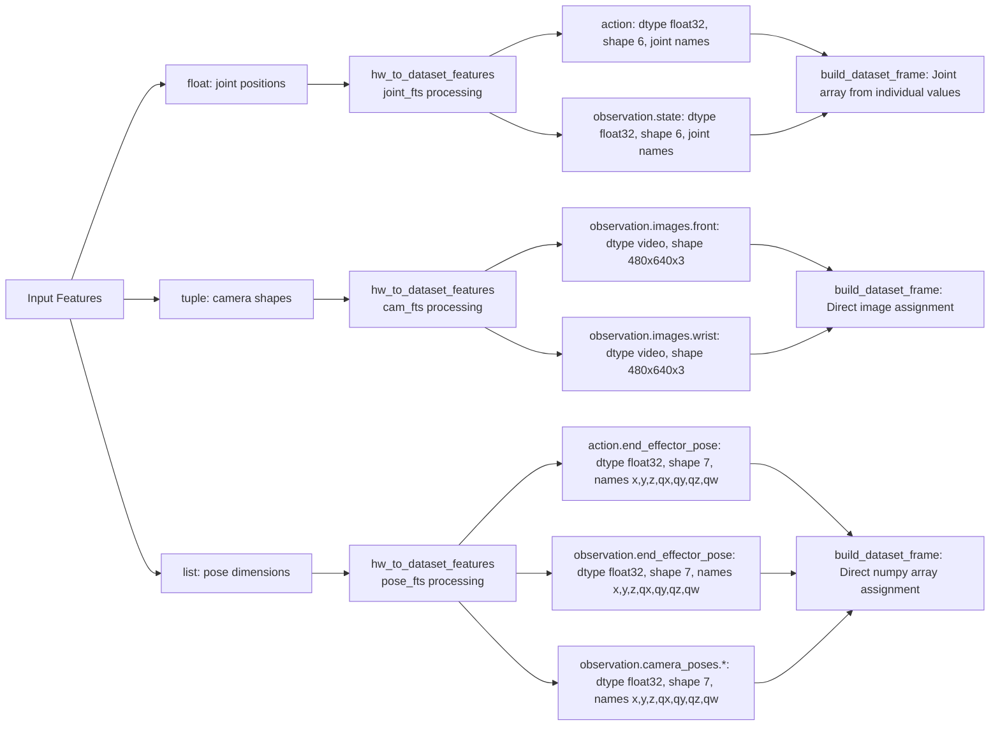

# RynnDataset Pipeline Documentation

## Overview

This document provides a comprehensive call graph and data flow analysis of the RynnDataset recording and storage pipeline. The pipeline processes robot teleoperation data including joint positions, end-effector poses, camera poses, and RGB video streams into structured datasets.

## Complete Pipeline Architecture



## Phase-by-Phase Breakdown

### 1. Initialization Phase



**Key Components:**

- **`get_robot_features()`**: Defines data types for joints (float), cameras (tuple), poses (list)
- **`hw_to_dataset_features()`**: Converts hardware features to dataset format
- **Feature Type Processing**: Creates appropriate field structures for each data type

### 2. Recording Loop



**Data Collection Points:**

- **Joint Data**: 6 DOF robot joint positions and commands
- **End-Effector Poses**: 7D pose arrays (position + quaternion)
- **Camera Data**: RGB frames and optical center poses
- **Type Safety**: All poses converted to float32 for consistency

### 3. Feature Type Processing



## Core Implementation Details

### Feature Detection Logic

The pipeline uses type-based feature detection:

```python
# In hw_to_dataset_features()
joint_fts = {key: ftype for key, ftype in hw_features.items() if ftype is float}
cam_fts = {key: shape for key, shape in hw_features.items() if isinstance(shape, tuple)}
pose_fts = {key: shape for key, shape in hw_features.items() if isinstance(shape, list)}
```

### Data Type Processing

**Joint Features (float type):**

- Individual float values grouped into arrays
- Names preserve semantic meaning (e.g., "shoulder_pan.pos")
- Built using: `np.array([values[name] for name in ft["names"]])`

**Camera Features (tuple type):**

- RGB frames stored as video files
- Shape information: `(height, width, channels)`
- Processed as: `observation.images.{camera_name}`

**Pose Features (list type):**

- 7D pose arrays with meaningful names
- Consistent float32 dtype
- Direct numpy array assignment

### Meaningful Field Names

Pose features now use semantic names instead of generic dimensions:

```python
# 7D poses get meaningful names
if shape[0] == 7:
    pose_names = ["x", "y", "z", "qx", "qy", "qz", "qw"]
else:
    pose_names = [f"dim_{i}" for i in range(shape[0])]
```

## Output Structure

### Directory Layout

```
outputs/MMDD_HHMM/
├── data/
│   └── chunk-000/
│       └── episode_000000.parquet  # All numeric data
├── videos/
│   └── chunk-000/
│       ├── observation.images.front/
│       │   └── episode_000000.mp4
│       └── observation.images.wrist/
│           └── episode_000000.mp4
└── meta/
    ├── info.json        # Dataset metadata
    ├── tasks.jsonl      # Task definitions
    ├── episodes.jsonl   # Episode metadata
    └── stats/           # Dataset statistics
```

### Parquet Schema

The final parquet files contain clean, separate fields:

```json
{
  "action": [joint1, joint2, joint3, joint4, joint5, gripper],
  "action.end_effector_pose": [x, y, z, qx, qy, qz, qw],

  "observation.state": [joint1, joint2, joint3, joint4, joint5, gripper],
  "observation.end_effector_pose": [x, y, z, qx, qy, qz, qw],
  "observation.camera_poses.front": [x, y, z, qx, qy, qz, qw],
  "observation.camera_poses.wrist": [x, y, z, qx, qy, qz, qw],

  "timestamp": 0.033,
  "frame_index": 1,
  "episode_index": 0,
  "task_index": 0
}
```

### Metadata Schema

The `info.json` contains feature definitions with meaningful names:

```json
{
  "features": {
    "action.end_effector_pose": {
      "dtype": "float32",
      "shape": [7],
      "names": ["x", "y", "z", "qx", "qy", "qz", "qw"]
    },
    "observation.camera_poses.front": {
      "dtype": "float32",
      "shape": [7],
      "names": ["x", "y", "z", "qx", "qy", "qz", "qw"]
    }
  }
}
```

## Key Architectural Benefits

### 🎯 **Clean Data Separation**

- Joint data grouped logically
- Pose data as separate accessible arrays
- Video data in efficient MP4 format

### 🏗️ **Extensible Design**

- Type-based feature detection
- Easy to add new pose types
- Flexible field naming system

### 🔧 **Type Safety**

- Consistent float32 dtype for poses
- Proper error handling and fallbacks
- Validation at each processing step

### 📊 **Meaningful Metadata**

- Semantic field names (x,y,z,qx,qy,qz,qw)
- Complete feature documentation
- Easy data analysis and visualization

### 🚀 **Performance Optimized**

- Direct numpy array assignment for poses
- Efficient video encoding
- Minimal data copying

## Usage Examples

### Loading Dataset

```python
from RynnMotion.RynnDatasets import RynnDataset

# Load dataset
dataset = RynnDataset("path/to/outputs/MMDD_HHMM")

# Access different data types
joint_actions = dataset["action"]  # Joint commands only
ee_poses = dataset["action.end_effector_pose"]  # End-effector poses
camera_poses = dataset["observation.camera_poses.front"]  # Camera poses
```

### Data Analysis

```python
import pandas as pd

# Load parquet directly
df = pd.read_parquet("episode_000000.parquet")

# Analyze end-effector trajectory
ee_trajectory = df["observation.end_effector_pose"]
positions = ee_trajectory.apply(lambda x: x[:3])  # Extract x,y,z
orientations = ee_trajectory.apply(lambda x: x[3:])  # Extract qx,qy,qz,qw
```

## Recent Improvements

### ✅ **Enhanced Pose Support**

- Added list-type feature detection in `hw_to_dataset_features`
- Implemented pose array handling in `build_dataset_frame`
- Clean separation from joint and camera processing

### ✅ **Meaningful Field Names**

- Changed from generic `dim_0, dim_1, ...` to semantic `x, y, z, qx, qy, qz, qw`
- Improved readability and usability
- Maintained backward compatibility

### ✅ **Type Safety**

- All pose arrays converted to consistent float32 dtype
- Eliminated dtype mismatch errors
- Robust error handling throughout pipeline

### ✅ **Architecture Cleanup**

- Elegant three-way feature detection (float/tuple/list)
- Extensible design for future pose types
- Clean code organization and documentation

This pipeline now provides a robust, extensible, and user-friendly framework for robot dataset collection and storage.
