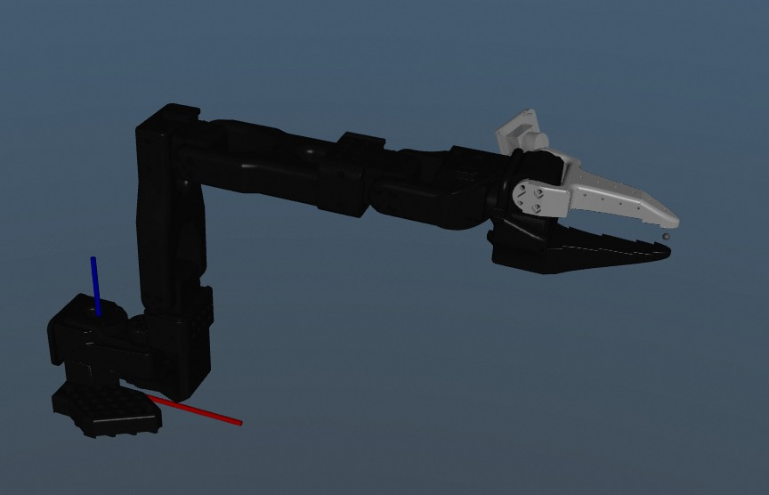
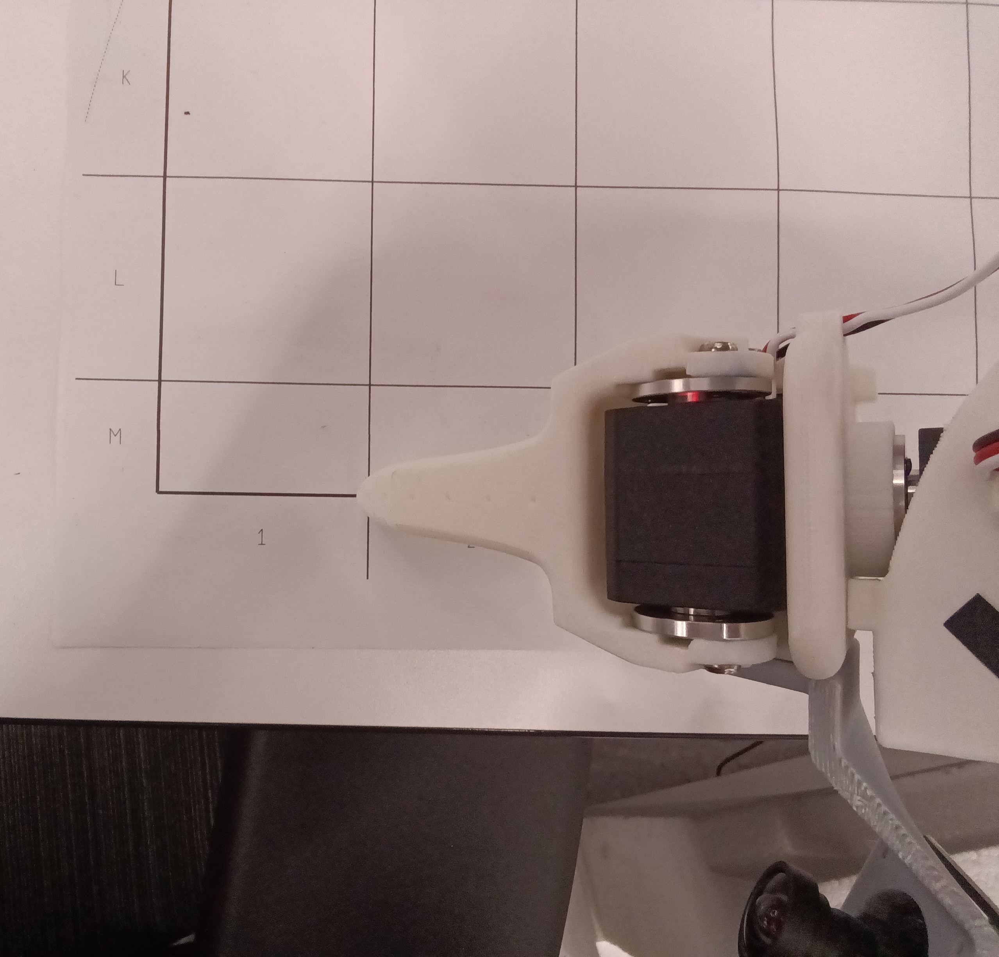
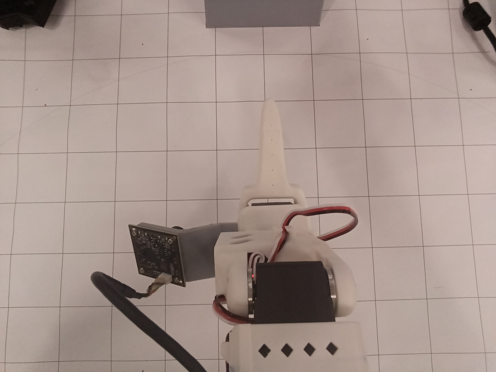
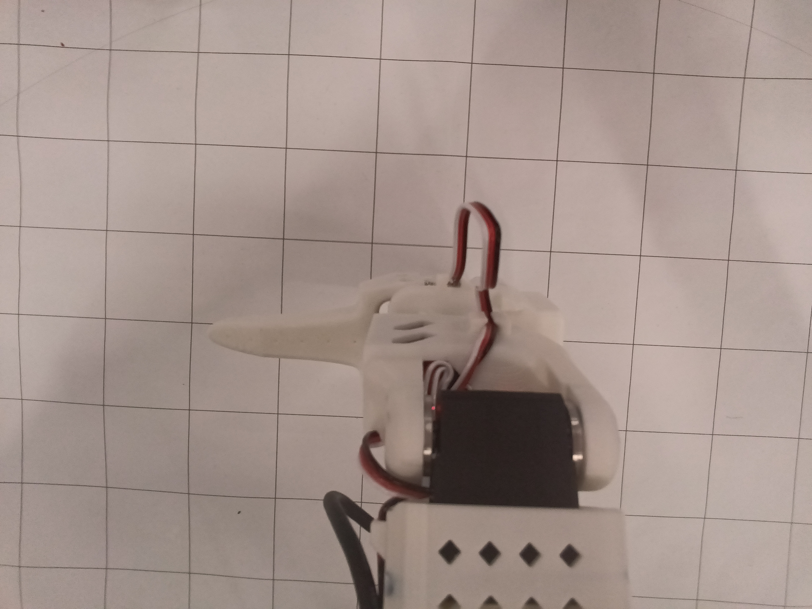
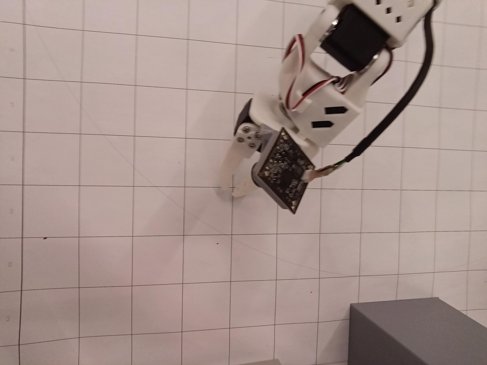
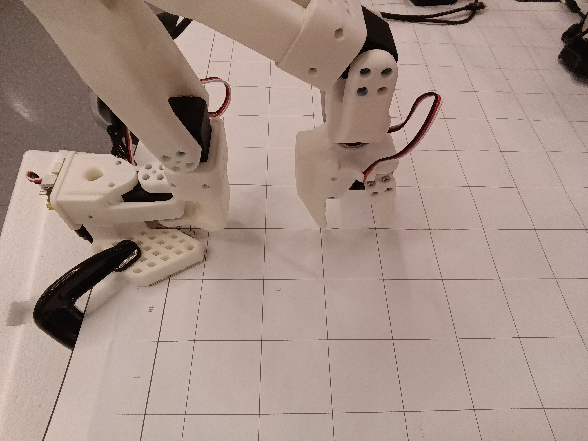

# SO101 校准操作指南

## 1. 激活虚拟环境

```bash
cd xxx/RynnLeRobot
bash ./setup_env.sh
source .venv/bin/activate
```

## 2. 识别串口号

```bash
find-motor-port
```

确认 Follower 和 Leader 的端口：

- **Linux**: `/dev/ttyACMx` 等
- **macOS**: `/dev/cu.usbmodem5A6801xxxxx` 等

## 3. 运行校准

```bash
calibrate
```

## 4. 校准步骤

### 步骤 1：设置零位偏移

当屏幕提示 **"Move arm to middle position"** 时：

1. 将机械臂**每个关节**移动到**物理中间位置**（参考下图，大致在该位置即可）
2. 按 **Enter**



### 步骤 2：记录运动范围

当屏幕提示 **"Move joints through range of motion"** 时：

依次运动每个关节：
#### 关节1（shoulder_pan）

从中间位置缓慢移动关节1至夹爪中线对齐桌布底线（见下图），然后拖动机械臂运动到夹爪中线对齐另一侧的底线。注意不要让夹爪超过底线，如果超过，你可以随时停止并重新开始标定。
推荐将夹爪中线移动到距离机械臂安装底座较远且对称的底线位置，比如区域2与区域15的底线。



#### 关节5（wrist_roll）

从中间位置（见下图左）缓慢旋转关节5至正负90°，注意不要让旋转角度显著大于正负90度，如果不小心超过90度，你可以随时停止并重新开始标定。

<table>
  <tr>
    <td></td>
    <td></td>
  </tr>
</table>

#### 其他关节（关节2、3、4、6）

缓慢移动每个关节至最大角度与最小角度（不限制移动轴的顺序、不限制先旋转到最大还是最小角度），移动期间注意不要让关节1和关节5超过前述最大运动范围。

完成后按 **Enter**。

## 5. 检查校准结果

校准文件位置：`~/.cache/huggingface/lerobot/calibration/<device_id>/calibration.json`

### 好的校准数据示例

```json
{
  "shoulder_pan": {
    "homing_offset": -1566,
    "range_min": 994,
    "range_max": 3064
  },
  "shoulder_lift": {
    "homing_offset": -2004,
    "range_min": 306,
    "range_max": 2621
  },
  "elbow_flex": {
    "homing_offset": -1947,
    "range_min": 1108,
    "range_max": 3297
  },
  "wrist_flex": { "homing_offset": -1630, "range_min": 731, "range_max": 3210 },
  "wrist_roll": { "homing_offset": -1596, "range_min": 913, "range_max": 3093 },
  "gripper": { "homing_offset": 974, "range_min": 2015, "range_max": 3522 }
}
```

### 检查要点

| 检查项                        | 合格标准           |
| ----------------------------- | ------------------ |
| `range_max - range_min`       | 约 2000-2500 ticks |
| `(range_min + range_max) / 2` | 接近 2047          |
| `homing_offset`               | 绝对值通常 < 2048  |

### 坏的校准数据特征

```json
{
  "shoulder_lift": {
    "homing_offset": 1834,
    "range_min": 583,
    "range_max": 2835
  }
}
```

问题：`(583 + 2835) / 2 = 1709`，偏离 2047 达 338 ticks，说明步骤 2 时两方向运动不对称。

## 6. 验证校准

### 粗略检查

```bash
show-joint-angles
```

将 SO101 拖到中间位置，关节角度应接近 `0, 0, 0, 0, 0, 0`。

如果某个关节偏离 0 较大（如 >5°），说明该关节校准有问题，需重新校准。

### 精确检查

运行：

```bash
check-calibrate 1    # 全零位置 [0, 0, 0, 0, 0, 0]
```

机械臂应运动到物理中间位置（大臂竖直，小臂水平指向前方，夹爪闭合，从机械臂后方观察，相机在左侧，见步骤1图）

```bash
check-calibrate 2    # point to E-F-12-13
check-calibrate 3    # point to H-J-8-9 and J-K-8-9
```

输入参数2机械臂应夹爪张开约1cm,夹爪尖端悬在E-F区分界线和12-13区分界线的交点上约1cm（下图左，具体精度指标视你的任务而定，比如你想要做一些非精确任务，精度指标可以适当放宽）
输入参数3机械臂夹爪张开，两个夹爪尖端分别悬在H-J-8-9交点和J-K-8-9交点上约1cm（下图右，精度要求同上）

<table>
  <tr>
    <td></td>
    <td></td>
  </tr>
</table>


```bash
check-calibrate 4    # elbow_flex +90° [0, 0, 1.57, 0, 0, 0]
```

机械臂会自动运动到目标位置，观察实际姿态是否与预期一致。按 `Ctrl+C` 退出。

**如果观察到姿态偏离设定值较远，建议重新执行校准步骤，否则会影响后续模型部署效果**。