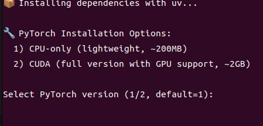
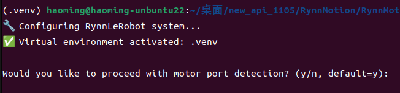
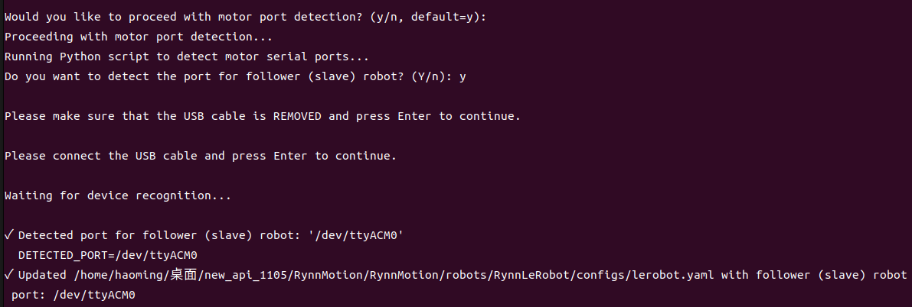
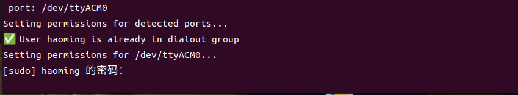
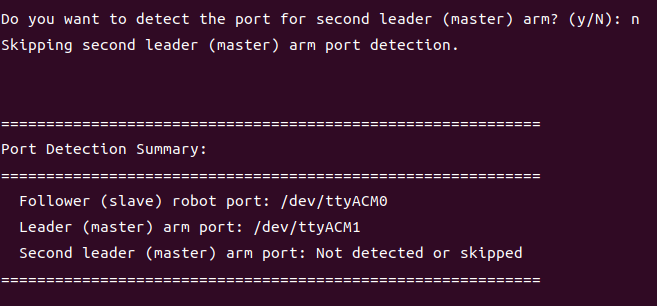
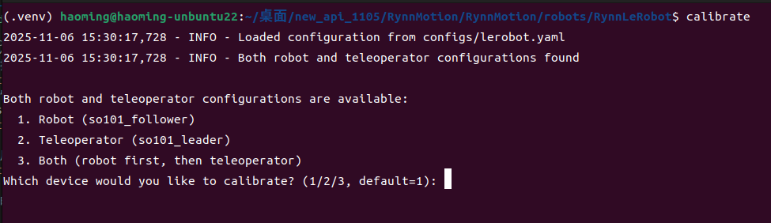
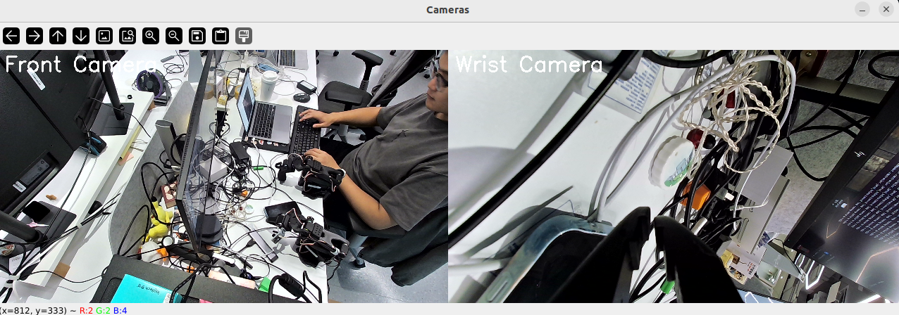
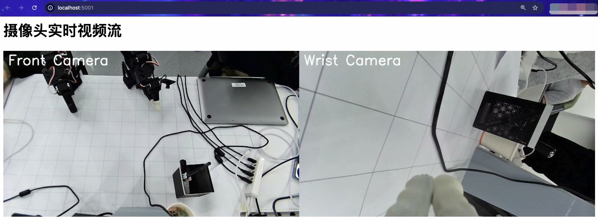
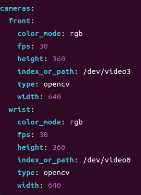
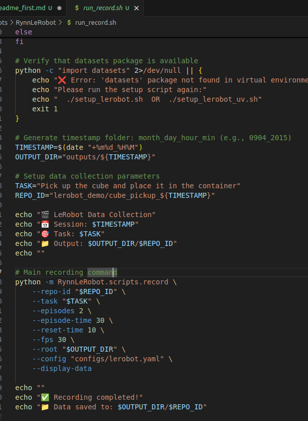

# RynnLeRobot 使用指南

## 安装环境

```
cd .../RynnMotion/robots/RynnLeRobot
bash install_env.sh
```



终端输出

```
🚀 Setting up RynnMotion-LeRobot/LeKiwi Motion Control System environment with uv...
✅ uv is already installed
📦 Creating virtual environment with uv...
Using CPython 3.13.9
Creating virtual environment at: .venv
✔ A virtual environment already exists at `.venv`. Do you want to replace it? · yes
Activate with: source .venv/bin/activate
✅ Virtual environment activated: .venv
📍 Updated PATH to prioritize venv binaries
🔧 Setting up PYTHONPATH for common modules...
✅ PYTHONPATH set to include common directory: /home/shengke/code/RynnMotion/robots/RynnLeRobot/../../../
✅ Added PYTHONPATH and PATH to virtual environment activation script
📦 Installing dependencies with uv...

🔧 PyTorch Installation Options:
  1) CPU-only (lightweight, ~200MB)
  2) CUDA (full version with GPU support, ~2GB)

🔧 Automatically selecting default option (CPU-only)...
🔧 Installing PyTorch CPU-only version...
🔧 Installing PyTorch and torchvision...
```

安装完成后，执行 source 命令激活虚拟环境：

```
# MacOS
source venv/bin/activate
# Ubuntu:
source .venv/bin/activate
```

## 配置机械臂端口与相机端口

```
bash setup_config.sh
```

按照提示操作即可，运行脚本前需要先断开相机 USB 连接  
  
先配置从臂，然后配置主臂  
先拔出 usb 线，按回车后，插入 usb 线再按回车即可完成机械臂端口识别以及配置文件端口修改


接着提供用户密码，程序会自动为机械臂端口设置权限


然后同样的操作配置主臂即可

设置完成，主从臂设置信息显示如图  


终端输出

```
🌍 Select language / 选择语言:
1) English (EN)
2) 中文 (CN)
Please select language (1/2, default=1): 2
🔧 正在配置 RynnLeRobot 系统...
✅ 虚拟环境已激活: .venv

是否继续进行电机端口检测? (y/n, 默认=y): y
正在执行电机端口检测...
正在运行电机端口检测脚本...
是否检测 follower (slave) robot 的端口? (Y/n): y
请确保 USB 线已断开连接，然后按回车键继续。

请连接 USB 线，然后按回车键继续。

等待设备识别...
follower (slave) robot 检测到的端口: '/dev/ttyACM1'
检测到的端口=/dev/ttyACM1
已在 /mnt/data/xueshengke/code/RynnMotion/robots/RynnLeRobot/configs/lerobot.yaml 中更新 follower (slave) robot 端口: /dev/ttyACM1
正在为检测到的端口设置权限...
用户 shengke 已经在 dialout 组中
正在为 /dev/ttyACM1 设置权限...
[sudo] password for shengke:
/dev/ttyACM1 权限设置成功

是否检测 leader (master) arm 的端口? (Y/n): y
请确保 USB 线已断开连接，然后按回车键继续。

请连接 USB 线，然后按回车键继续。

等待设备识别...
leader (master) arm 检测到的端口: '/dev/ttyACM0'
检测到的端口=/dev/ttyACM0
已在 /mnt/data/xueshengke/code/RynnMotion/robots/RynnLeRobot/configs/lerobot.yaml 中更新 leader (master) arm 端口: /dev/ttyACM0
正在为检测到的端口设置权限...
用户 shengke 已经在 dialout 组中
正在为 /dev/ttyACM0 设置权限...
/dev/ttyACM0 权限设置成功


============================================================
端口检测摘要:
============================================================
  Follower (slave) robot 端口: /dev/ttyACM1
  Leader (master) arm 端口: /dev/ttyACM0
============================================================

是否继续进行摄像头端口检测? (y/n, 默认=y): y
正在执行摄像头端口检测...
正在运行摄像头端口检测脚本...
<frozen runpy>:128: RuntimeWarning: 'RynnLeRobot.scripts.find_camera_port' found in sys.modules after import of package 'RynnLeRobot.scripts', but prior to execution of 'RynnLeRobot.scripts.find_camera_port'; this may result in unpredictable behaviour
相机检测
2025-12-05 18:09:06,498 [INFO] 正在列出可用相机...
2025-12-05 18:09:06,535 [INFO] 在 Ubuntu 上找到 2 个外部相机

--- 已检测到的相机 ---
相机 #0:
  Name:
  Type:
  Id:
  Backend api:
  Default stream profile:
    Format: 0.0
    Width: 640
    Height: 480
    Fps: 30.0
--------------------
相机 #1:
  Name:
  Type:
  Id:
  Backend api:
  Default stream profile:
    Format: 0.0
    Width: 640
    Height: 480
    Fps: 30.0
--------------------
==================================================
🎯 相机检测
==================================================
🔍 硬编码相机检测 - 使用平台特定的相机分配...
2025-12-05 18:09:06,535 [INFO] 正在列出可用相机...
2025-12-05 18:09:06,571 [INFO] 在 Ubuntu 上找到 2 个外部相机
2025-12-05 18:09:06,571 [INFO] 在 Ubuntu 上找到 0 个外部相机
在 Ubuntu 上找到 0 个外部相机
⚠️ 仅找到 0 个外部相机，至少需要 2 个
⚠️ 硬编码检测失败，回退到手动检测...
📋 使用手动插拔检测方法...
请确保 FRONT 相机已断开连接，然后按 Enter 继续。

2025-12-05 18:09:12,381 [INFO] 正在列出可用相机...
2025-12-05 18:09:12,400 [INFO] 在 Ubuntu 上找到 1 个外部相机
请连接 FRONT 相机，然后按 Enter 继续。

2025-12-05 18:09:16,629 [INFO] 正在列出可用相机...
2025-12-05 18:09:16,665 [INFO] 在 Ubuntu 上找到 2 个外部相机
FRONT 相机的 ID 为: '/dev/video2'
DETECTED_FRONT_CAMERA=/dev/video2

请确保 WRIST 相机已断开连接，然后按 Enter 继续。

2025-12-05 18:09:20,429 [INFO] 正在列出可用相机...
2025-12-05 18:09:20,447 [INFO] 在 Ubuntu 上找到 1 个外部相机
请连接 WRIST 相机，然后按 Enter 继续。

2025-12-05 18:09:25,324 [INFO] 正在列出可用相机...
2025-12-05 18:09:25,360 [INFO] 在 Ubuntu 上找到 2 个外部相机
WRIST 相机的 ID 为: '/dev/video0'
DETECTED_WRIST_CAMERA=/dev/video0
✅ 已分配正面相机: /dev/video2
✅ 已分配腕部相机: /dev/video0
图像捕获已完成。图像已保存至 /mnt/data/xueshengke/code/RynnMotion/robots/RynnLeRobot/configs/lerobot.yaml
✅ 已使用硬编码分配完成相机检测
==================================================
==================================================

✅ 配置完成!

🎯 快速启动命令 (激活后使用):

🔧 设备校准命令:

  # 自动校准机器人或遥操作设备 (从 configs/lerobot.yaml 读取配置):
  python -m RynnLeRobot.scripts.calibrate

  # 脚本会根据您的配置文件自动检测并校准

  # 运行 so101 follower 模拟模式或真实模式
  python -m RynnLeRobot.controller.lerobot --mode sim --motion 2
  python -m RynnLeRobot.controller.lerobot --mode real

  # 运行 so101 leader & follower 遥操作模拟模式或真实模式

  # 使用新的 joint-teleop 命令:
  joint-teleop --mode sim
  joint-teleop --mode real

  # 或者直接使用 python 模块:
  python -m RynnLeRobot.controller.joint_teleop --mode sim
  python -m RynnLeRobot.controller.joint_teleop --mode real

  # 使用 uv 直接运行 (无需激活环境):
  uv run python -m RynnLeRobot.controller.lerobot --mode sim --motion 2
```

设置相机

- 先保持相机都未接入，然后按照提示依次按照 front、wrist 接入即可。

## 校准

```
calibrate --lang CN
# 或
python -m RynnLeRobot.scripts.calibrate --lang CN
```

遥操发现位置存在偏移过大时可重新校准，直接执行 calibrate 即可  
1.只校准从臂 2.只校准主臂 3.主从臂都校准  


终端输出

```
2025-12-05 18:13:17,356 - INFO - 已从 configs/lerobot.yaml 加载配置
2025-12-05 18:13:17,356 - INFO - 已找到机器人和遥控器的配置

已找到机器人和遥控器的配置:
  1. 机器人 (so101_follower)
  2. 遥控器 (so101_leader)
  3. 两者 (先机器人，后遥控器)
您想校准哪个设备? (1/2/3, 默认=1): 3
2025-12-05 18:13:18,650 - INFO - User selected: Calibrate both devices

============================================================
正在校准机器人
============================================================
2025-12-05 18:13:18,650 - INFO - 找到 robot 配置: 类型=so101_follower, ID=so101_follower, 端口=/dev/ttyACM1
2025-12-05 18:13:18,650 - INFO - 校准文件: ~/.cache/huggingface/lerobot/calibration/robots/so101_follower
2025-12-05 18:13:18,650 - INFO - Set calibration file path: /home/shengke/.cache/huggingface/lerobot/calibration/robots/so101_follower
2025-12-05 18:13:18,651 - INFO - 已连接到 SO101Follower
2025-12-05 18:13:18,680 - INFO - so101_follower connected.
2025-12-05 18:13:18,680 - INFO - 开始校准 SO101Follower...
Press ENTER to use provided calibration file associated with the id=so101_follower, or type 'c' and press ENTER to run calibration:
按下回车键以使用 id=so101_follower 提供的关联校准文件，或者输入'c'并按下回车键以重新运行校准: c
2025-12-05 18:13:21,773 - INFO - 
Running calibration of so101_follower
Move so101_follower to the middle of its range of motion and press ENTER
把所有关节移动到零状态位, 再按回车键继续....
Move all joints sequentially through their entire ranges of motion. Recording positions. Press ENTER to stop...
依次移动所有关节，通过其整个运动范围记录最大、最小的位置。按回车键停止 ...

-------------------------------------------
-------------------------------------------
NAME            |    MIN |    POS |    MAX
shoulder_pan    |    985 |   2067 |   3071
shoulder_lift   |    875 |   1021 |   3228
elbow_flex      |    830 |   3054 |   3054
wrist_flex      |    695 |   2668 |   3155
wrist_roll      |   1015 |   1984 |   3090
gripper         |   2024 |   2071 |   3512
Calibration saved to /home/shengke/.cache/huggingface/lerobot/calibration/robots/so101_follower/so101_follower.json
2025-12-05 18:14:28,156 - INFO - 校准完成
2025-12-05 18:14:28,194 - INFO - so101_follower disconnected.
2025-12-05 18:14:28,194 - INFO - 已断开 SO101Follower

============================================================
正在校准遥控器
============================================================
2025-12-05 18:14:28,194 - INFO - 找到 teleoperator 配置: 类型=so101_leader, ID=so101_leader, 端口=/dev/ttyACM0
2025-12-05 18:14:28,194 - INFO - 校准文件: ~/.cache/huggingface/lerobot/calibration/teleoperators/so101_leader
2025-12-05 18:14:28,194 - INFO - Set calibration file path: /home/shengke/.cache/huggingface/lerobot/calibration/teleoperators/so101_leader
2025-12-05 18:14:28,194 - INFO - 已连接到 SO101Follower
2025-12-05 18:14:28,224 - INFO - so101_leader connected.
2025-12-05 18:14:28,224 - INFO - 开始校准 SO101Follower...
Press ENTER to use provided calibration file associated with the id=so101_leader, or type 'c' and press ENTER to run calibration:
按下回车键以使用 id=so101_leader 提供的关联校准文件，或者输入'c'并按下回车键以重新运行校准: c
2025-12-05 18:14:32,913 - INFO - 
Running calibration of so101_leader
Move so101_leader to the middle of its range of motion and press ENTER
把所有关节移动到零状态位, 再按回车键继续....
Move all joints sequentially through their entire ranges of motion. Recording positions. Press ENTER to stop...
依次移动所有关节，通过其整个运动范围记录最大、最小的位置。按回车键停止 ...

-------------------------------------------
-------------------------------------------
NAME            |    MIN |    POS |    MAX
shoulder_pan    |    993 |   2045 |   3169
shoulder_lift   |    831 |    839 |   3169
elbow_flex      |    924 |   3112 |   3113
wrist_flex      |    741 |   2563 |   3198
wrist_roll      |    986 |   2097 |   3176
gripper         |   2045 |   2047 |   3025
Calibration saved to /home/shengke/.cache/huggingface/lerobot/calibration/teleoperators/so101_leader/so101_leader.json
2025-12-05 18:15:36,767 - INFO - 校准完成
2025-12-05 18:15:36,805 - INFO - so101_leader disconnected.
2025-12-05 18:15:36,805 - INFO - 已断开 SO101Follower
```

## 遥操测试（物理真机）

```
# 不显示图像
joint-teleop --mode real
# 本地桌面显示图像
joint-teleop --mode real --show-display --log-level=INFO
# 浏览器网页显示图像
joint-teleop --mode real --show-webcam --log-level=INFO
```





终端输出

```
WARNING:root:is_headless: 'DISPLAY' environment variable not set. Assuming headless.
WARNING:root:Running in headless mode. Set args.show_display=False.
Namespace(mode='real', ctrlfreq=100, config='configs/lerobot.yaml', show_display=False, show_webcam=True, log_level='INFO', lang='EN')
✓ Log file: /home/shengke/RynnRcplog/robotMotion/robotMotion_20251204_2310.log
2025-12-04 23:10:23,337 [INFO] Initialized real robot interface with 6 joints
2025-12-04 23:10:23,539 [INFO] Initialized teleop robot interface with 6 joints
2025-12-04 23:10:23,539 [INFO] Initializing real robot on port: /dev/ttyACM1
2025-12-04 23:10:23,568 [INFO] so101_follower connected.
2025-12-04 23:10:23,568 [INFO] Initialized real robot with timestep 0.01s
2025-12-04 23:10:23,568 [INFO] Initializing teleop robot on port: /dev/ttyACM0
2025-12-04 23:10:23,594 [INFO] so101_leader SO101Leader connected.
2025-12-04 23:10:23,594 [INFO] Initialized teleop robot with timestep 0.01s
2025-12-04 23:10:23,594 [INFO] ✓ Camera configured for simulation
2025-12-04 23:10:23,594 [INFO] Leader interface class: LeRobotInterface
2025-12-04 23:10:23,594 [INFO] Leader data reader thread started
2025-12-04 23:10:23,595 [INFO] Started leader data reader thread at 200Hz
2025-12-04 23:10:23,595 [INFO] ✓ Leader data reader thread started for real robot
2025-12-04 23:10:23,795 [INFO] Initial joint positions: [ 0.23732522 -1.73637119  1.74374403  0.8562799   0.22467858  0.20746888]
2025-12-04 23:10:23,795 [INFO] ✓ Leader and follower interfaces ready in real mode
2025-12-04 23:10:23,819 [INFO] ✓ Pinocchio kinematics initialized
2025-12-04 23:10:23,819 [INFO]   MJCF: /mnt/data/xueshengke/code/RynnMotion/models/3.robot_arm/24.so101/mjcf/so101_pinocchio.xml
2025-12-04 23:10:23,819 [INFO]   EE frame: EE
2025-12-04 23:10:24,874 [INFO] OpenCVCamera(/dev/video2) connected.
2025-12-04 23:10:24,875 [INFO] ✅ front camera connected on port /dev/video2
2025-12-04 23:10:25,927 [INFO] OpenCVCamera(/dev/video0) connected.
2025-12-04 23:10:25,927 [INFO] ✅ wrist camera connected on port /dev/video0
2025-12-04 23:10:25,927 [INFO] ============================================================
2025-12-04 23:10:25,927 [INFO] LEROBOT Teleoperation Controller is running!
2025-12-04 23:10:25,927 [INFO] Mode: real
2025-12-04 23:10:25,927 [INFO] Control frequency: 100 Hz
2025-12-04 23:10:25,927 [INFO] Show Display: False; Show Web Camera: True
2025-12-04 23:10:25,927 [INFO] Press Ctrl+C or close viewer window to stop
2025-12-04 23:10:25,927 [INFO] ============================================================
2025-12-04 23:10:25,936 [INFO] follower (degree): [ 13.60, -99.49,  99.91,  49.06,  12.87,   0.21]
INFO:     Started server process [13887]
INFO:     Waiting for application startup.
INFO:     Application startup complete.
INFO:     Uvicorn running on http://0.0.0.0:5001 (Press CTRL+C to quit)
2025-12-04 23:10:27,518 [INFO] follower (degree): [ 13.60, -99.49,  99.91,  49.06,  12.87,   0.21]
2025-12-04 23:10:27,518 [WARNING] Control loop running behind by 0.022s
2025-12-04 23:10:29,177 [INFO] follower (degree): [ 13.60, -99.49,  99.91,  49.06,  12.87,   0.21]
2025-12-04 23:10:30,873 [WARNING] Control loop running behind by 0.026s
^C2025-12-04 23:10:31,310 [INFO]
Stopping teleoperation controller...
2025-12-04 23:10:31,310 [INFO] Cleaning up...
2025-12-04 23:10:31,422 [INFO] OpenCVCamera(/dev/video2) disconnected.
2025-12-04 23:10:31,422 [INFO] 🔌 front camera disconnected
2025-12-04 23:10:31,434 [INFO] OpenCVCamera(/dev/video0) disconnected.
2025-12-04 23:10:31,434 [INFO] 🔌 wrist camera disconnected
23:10:31 🛑 请求停止服务器...
INFO:     Shutting down
23:10:31 ✅ 停止请求已发送
2025-12-04 23:10:31,534 [INFO] Stopping leader data reader thread...
2025-12-04 23:10:31,537 [INFO] Leader data reader thread finished
2025-12-04 23:10:31,537 [INFO] Leader data reader thread stopped
2025-12-04 23:10:31,537 [INFO] ✓ Leader data reader thread stopped
INFO:     Waiting for application shutdown.
INFO:     Application shutdown complete.
INFO:     Finished server process [13887]
2025-12-04 23:10:31,575 [INFO] so101_leader SO101Leader disconnected.
2025-12-04 23:10:31,575 [INFO] Disconnected from teleop robot
2025-12-04 23:10:31,575 [INFO] ✓ Leader robot disconnected
2025-12-04 23:10:31,613 [INFO] so101_follower disconnected.
2025-12-04 23:10:31,613 [INFO] Disconnected from real robot
2025-12-04 23:10:31,613 [INFO] ✓ Follower robot disconnected
2025-12-04 23:10:31,613 [INFO] ✓ Cleanup completed
```

查看画面中画面是否都有以及前置与腕部视角是否正确，若不正确可手动修改配置文件：

```
vim configs/lerobot.yaml
```

除了修改端口，还可以修改分辨率（需要摄像头能支持的分辨率）

<!--    -->

```yaml
cameras:
  front:
    color_mode: rgb
    fps: 30
    height: 360
    index_or_path: /dev/video2
    type: opencv
    width: 640
  wrist:
    color_mode: rgb
    fps: 30
    height: 360
    index_or_path: /dev/video0
    type: opencv
    width: 640
```

## 采集

```
bash run_record.sh
```

修改 run_record.sh 中的采集参数后执行

<!--  -->

```shell
export LANGUAGE="CN"
# export LANGUAGE=EN

OUTPUT_DIR="outputs"

# Setup data collection parameters
TASK="Pick up the cube and place it in the container"
REPO_ID="cube_pickup_1"

# Main recording command
python -m RynnLeRobot.scripts.record \
    --repo-id "$REPO_ID" \
    --task "$TASK" \
    --episodes 2 \
    --episode-time 10 \
    --reset-time 3 \
    --fps 30 \
    --root "$OUTPUT_DIR" \
    --config "configs/lerobot.yaml" \
    --show-webcam \
    --log-level INFO \
    --lang $LANGUAGE
```

终端输出

```
✅ Activated .venv virtual environment
🎬 LeRobot Data Collection
🎯 Task: Pick up the cube and place it in the container
📁 Output: outputs/cube_pickup_1

WARNING:root:is_headless: 'DISPLAY' environment variable not set. Assuming headless.
WARNING:root:Running in headless mode. Set args.show_display=False.
🔍 检测到操作系统: Linux
💡 提示：在部分 Linux 终端中，监听方向键/功能键可能需要以普通用户权限运行（无需 sudo）。
   如果按键无响应，请尝试在 GNOME Terminal、Konsole 或 tmux 中运行。
正在启动键盘监听器...

🎮 键盘控制 (录制期间有效):
   → (右方向键): 提前结束片段并保存部分数据
   ← (左方向键):  放弃当前片段并从头开始重录
   回车键:        暂停后继续
   q 或 Esc:        停止整个录制会话
   💡 提示: 如果想提前结束但保留已录制的数据，请按右方向键
           如果操作失误想完全重做，请按左方向键

WARNING:root:'torchcodec' is not available in your platform, falling back to 'pyav' as a default decoder
✓ Log file: /home/shengke/RynnRcplog/robotMotion/robotMotion_20251204_2311.log
2025-12-04 23:11:48,534 [INFO] Initialized real robot interface with 6 joints
2025-12-04 23:11:48,735 [INFO] Initialized teleop robot interface with 6 joints
2025-12-04 23:11:48,736 [INFO] Initializing real robot on port: /dev/ttyACM1
2025-12-04 23:11:48,768 [INFO] so101_follower connected.
2025-12-04 23:11:48,768 [INFO] Initialized real robot with timestep 0.03333333333333333s
2025-12-04 23:11:48,768 [INFO] Initializing teleop robot on port: /dev/ttyACM0
2025-12-04 23:11:48,798 [INFO] so101_leader SO101Leader connected.
2025-12-04 23:11:48,798 [INFO] Initialized teleop robot with timestep 0.03333333333333333s
2025-12-04 23:11:48,798 [INFO] ✓ Camera configured for simulation
2025-12-04 23:11:48,798 [INFO] Leader interface class: LeRobotInterface
2025-12-04 23:11:48,798 [INFO] Leader data reader thread started
2025-12-04 23:11:48,798 [INFO] Started leader data reader thread at 200Hz
2025-12-04 23:11:48,799 [INFO] ✓ Leader data reader thread started for real robot
2025-12-04 23:11:48,999 [INFO] Initial joint positions: [ 0.23732522 -1.73637119  1.74374403  0.8562799   0.22467858  0.20746888]
2025-12-04 23:11:48,999 [INFO] ✓ Leader and follower interfaces ready in real mode
2025-12-04 23:11:49,004 [INFO] ✓ Pinocchio kinematics initialized
2025-12-04 23:11:49,004 [INFO]   MJCF: /mnt/data/xueshengke/code/RynnMotion/models/3.robot_arm/24.so101/mjcf/so101_pinocchio.xml
2025-12-04 23:11:49,004 [INFO]   EE frame: EE
2025-12-04 23:11:49,004 [INFO] ============================================================
2025-12-04 23:11:49,004 [INFO] LEROBOT Teleoperation Controller is running!
2025-12-04 23:11:49,004 [INFO] Mode: real
2025-12-04 23:11:49,004 [INFO] Control frequency: 30 Hz
2025-12-04 23:11:49,005 [INFO] Show Display: False; Show Web Camera: False
2025-12-04 23:11:49,005 [INFO] Press Ctrl+C or close viewer window to stop
2025-12-04 23:11:49,005 [INFO] ============================================================
2025-12-04 23:11:51,004 [INFO] ✅ Teleoperation thread started
2025-12-04 23:11:51,005 [INFO]
============================================================
2025-12-04 23:11:51,005 [INFO] Episode 1/2
2025-12-04 23:11:51,005 [INFO] ============================================================
2025-12-04 23:11:51,005 [INFO] 🎮 Teleoperation is running
2025-12-04 23:11:51,005 [INFO] 📋 Setup your robot and environment for recording
2025-12-04 23:11:51,005 [INFO] ⏱️  Recording will last 10.0 seconds
▶️  Press ENTER when ready to start recording this episode...
INFO:     Started server process [14118]
INFO:     Waiting for application startup.
INFO:     Application startup complete.
INFO:     Uvicorn running on http://0.0.0.0:5001 (Press CTRL+C to quit)

已按下回车键。继续数据录制...
2025-12-04 23:12:02,507 [INFO] 📹 Recording episode: 300 frames (10.0s)
2025-12-04 23:12:02,508 [INFO] 🛑 Stopping entire recording session
2025-12-04 23:12:02,508 [INFO] ⚠️ Episode discarded: No frames recorded
2025-12-04 23:12:02,508 [INFO] ⏭️  Episode skipped - continuing to next episode
2025-12-04 23:12:02,508 [INFO] ⏳ Reset time: 3.0s
2025-12-04 23:12:02,508 [INFO]    Please reset the environment for next episode
2025-12-04 23:12:05,511 [INFO]

============================================================
2025-12-04 23:12:05,511 [INFO] Episode 2/2
2025-12-04 23:12:05,511 [INFO] ============================================================
2025-12-04 23:12:05,511 [INFO] 🎮 Teleoperation is running
2025-12-04 23:12:05,511 [INFO] 📋 Setup your robot and environment for recording
2025-12-04 23:12:05,511 [INFO] ⏱️  Recording will last 10.0 seconds
▶️  Press ENTER when ready to start recording this episode...

已按下回车键。继续数据录制...
2025-12-04 23:12:08,012 [INFO] 📹 Recording episode: 300 frames (10.0s)
2025-12-04 23:12:08,012 [INFO] 🛑 Stopping entire recording session
2025-12-04 23:12:08,012 [INFO] ⚠️ Episode discarded: No frames recorded
2025-12-04 23:12:08,012 [INFO] ⏭️  Episode skipped - continuing to next episode
2025-12-04 23:12:08,012 [INFO]
🎉 Dataset recording completed!
2025-12-04 23:12:08,012 [INFO]    Episodes recorded: 0
2025-12-04 23:12:08,012 [INFO]    Location: outputs/cube_pickup_1
23:12:08 🛑 请求停止服务器...
INFO:     Shutting down
23:12:08 ✅ 停止请求已发送
2025-12-04 23:12:08,127 [INFO] OpenCVCamera(/dev/video2) disconnected.
2025-12-04 23:12:08,127 [INFO] 🔌 front camera disconnected
2025-12-04 23:12:08,138 [INFO] OpenCVCamera(/dev/video0) disconnected.
2025-12-04 23:12:08,138 [INFO] 🔌 wrist camera disconnected
2025-12-04 23:12:08,138 [INFO] Cleaning up...
INFO:     Waiting for application shutdown.
INFO:     Application shutdown complete.
INFO:     Finished server process [14118]
2025-12-04 23:12:08,239 [INFO] Stopping leader data reader thread...
2025-12-04 23:12:08,240 [INFO] Leader data reader thread finished
2025-12-04 23:12:08,240 [INFO] Leader data reader thread stopped
2025-12-04 23:12:08,240 [INFO] ✓ Leader data reader thread stopped
2025-12-04 23:12:08,278 [INFO] so101_leader SO101Leader disconnected.
2025-12-04 23:12:08,278 [INFO] Disconnected from teleop robot
2025-12-04 23:12:08,278 [INFO] ✓ Leader robot disconnected
2025-12-04 23:12:08,286 [ERROR] Failed to write joint positions: (9, 'Bad file descriptor')
2025-12-04 23:12:08,286 [INFO] Cleaning up...
2025-12-04 23:12:08,315 [INFO] so101_follower disconnected.
2025-12-04 23:12:08,315 [INFO] Disconnected from real robot
2025-12-04 23:12:08,315 [INFO] ✓ Follower robot disconnected
2025-12-04 23:12:08,315 [INFO] ✓ Cleanup completed
2025-12-04 23:12:08,315 [INFO] 🛑 Teleoperation stopped
2025-12-04 23:12:08,315 [INFO] ✅ Recording completed successfully

✅ Recording completed!
📁 Data saved to: outputs/cube_pickup_1
```
